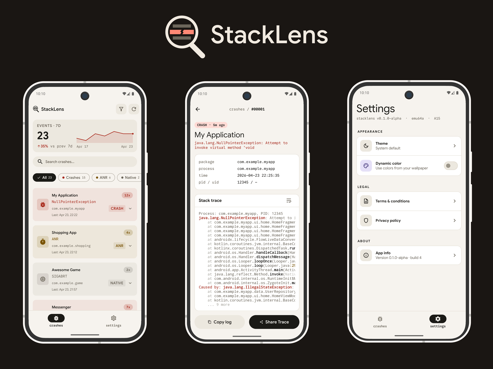

# 🔍 StackLens

<div align="center">

[](https://developer.android.com/)
[](https://kotlinlang.org/)
[](https://developer.android.com/jetpack/compose)
[](https://android-arsenal.com/api?level=21)
[](LICENSE)

*A powerful Android crash log viewer that reads system crash logs directly from your device. Built with Jetpack Compose and Material 3.*

[Features](#-features) • [Tech Stack](#-tech-stack) • [Usage](#-usage) • [Contributing](#-contributing)

</div>



---

## Features

- **View Crash Logs** - Read app crashes, ANRs, and native crashes from the system DropBox
- **Filter & Search** - Filter by crash type (Crashes, ANRs, Native) and search through logs
- **Sort Options** - Sort by newest or oldest first
- **Time Range** - Filter crashes from the last hour to the last 7 days
- **Detailed View** - View full stack traces with syntax highlighting
- **Share & Copy** - Easily share or copy crash logs
- **Dark Mode** - Full dark mode support with system theme following
- **Dynamic Colors** - Material You dynamic colors on Android 12+

---

## Requirements

- Android 5.0 (API 21) or higher
- ADB access for granting special permissions

---

## Permissions

StackLens requires special permissions that must be granted via ADB:

| Permission | Purpose |
|------------|---------|
| `READ_LOGS` | Read system crash logs |
| `READ_DROPBOX_DATA` | Access crash data from DropBoxManager |
| `PACKAGE_USAGE_STATS` | Get app names and icons (granted via Settings) |

---

## Usage

### From Source

1. Clone the repository:
   ```bash
   git clone https://github.com/jonathanlee06/StackLens.git
   ```

2. Open the project in Android Studio

3. Build and install the app:
   ```bash
   ./gradlew installDebug
   ```

### Granting Permissions

After installing the app, you need to grant the required permissions:

1. **Usage Stats Access** - Open the app and tap "Open Settings" to grant this permission from the system settings

2. **READ_LOGS Permission** - Connect your device via USB and run:
   ```bash
   adb shell pm grant com.devbyjonathan.stacklens android.permission.READ_LOGS
   ```

3. **READ_DROPBOX_DATA Permission** - Run:
   ```bash
   adb shell pm grant com.devbyjonathan.stacklens android.permission.READ_DROPBOX_DATA
   ```

> **Note:** The app will close automatically when granting ADB permissions. This is expected Android behavior - simply reopen the app.

---

## Tech Stack

- **Kotlin** - 100% Kotlin
- **Jetpack Compose** - Modern declarative UI
- **Material 3** - Material Design 3 with dynamic colors
- **Hilt** - Dependency injection
- **Coroutines & Flow** - Asynchronous programming
- **Navigation Compose** - Single activity navigation
- **DropBoxManager** - System crash log access

---

## 🤝 Contributing

We welcome contributions! Here's how you can help:

### **Ways to Contribute**

- 🐛 **Bug Reports**: Found a bug? [Open an issue](../../issues/new)
- ✨ **Feature Requests**: Have an idea? [Share it with us](../../issues/new)
- 🔧 **Code Contributions**: Submit a pull request
- 📖 **Documentation**: Help improve our docs
- 🌍 **Translations**: Add support for more languages

### **Development Workflow**

1. Fork the repository
2. Create a feature branch (`git checkout -b feature/amazing-feature`)
3. Commit your changes (`git commit -m 'Add amazing feature'`)
4. Push to the branch (`git push origin feature/amazing-feature`)
5. Open a Pull Request

---

## 📄 License

This project is dual-licensed:

### **Code License**

The source code is licensed under the **Apache License 2.0** - see the [LICENSE](LICENSE) file for
details.

### **Assets & Branding**

Logo, branding, and visual assets are proprietary and copyright protected -
see [ASSETS.md](ASSETS.md) for details.

**Note for Contributors:** When forking this project, please replace all branding assets with your
own.

---

## 👨‍💻 Author

**Jonathan Lee** - [GitHub Profile](https://github.com/jonathanlee06)

---

## 🙏 Acknowledgments

- Thanks to the Android team for Jetpack Compose
- Material Design team for the amazing design system
- Open source community for inspiration and tools

---

<div align="center">

**⭐ [Star](https://github.com/jonathanlee06/Teleport/stargazers) this repo if you find it helpful!**

Made with ❤️ and ☕ by Jonathan

</div>
