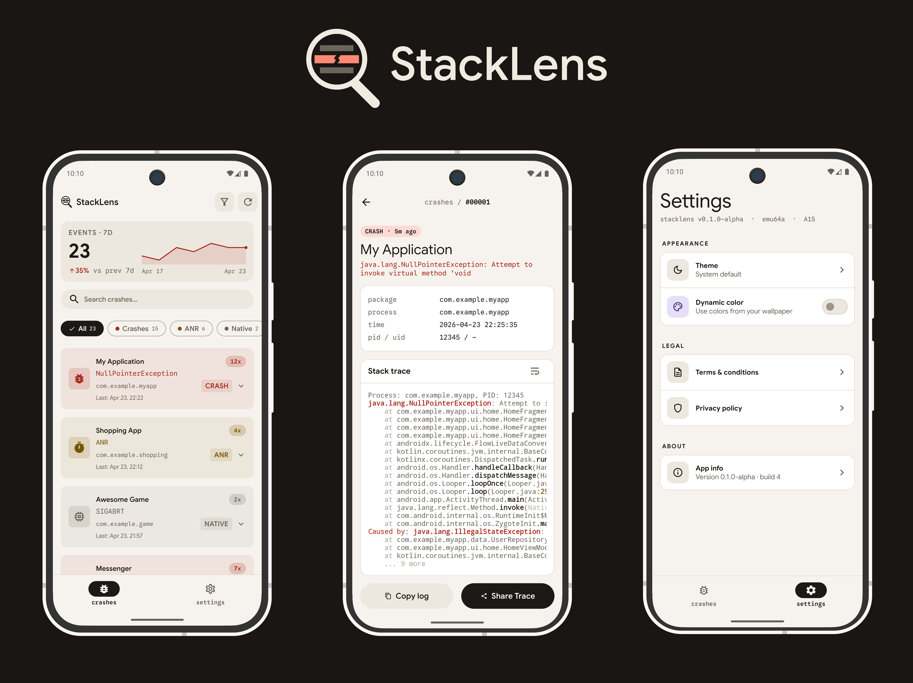

# 🔍 StackLens

<div align="center">

[](https://developer.android.com/)
[](https://kotlinlang.org/)
[](https://developer.android.com/jetpack/compose)
[](https://android-arsenal.com/api?level=23)
[](https://github.com/jonathanlee06/StackLens/releases)
[](LICENSE)

*A powerful Android crash log viewer that reads system crash logs directly from your device. Built with Jetpack Compose and Material 3.*

[Features](#-features) • [Tech Stack](#-tech-stack) • [Usage](#-usage) • [Contributing](#-contributing)

</div>



---

## Features

- **View Crash Logs** - Read app crashes, ANRs, and native crashes from the system DropBox
- **AI Crash Insights** - On-device Gemini Nano (ML Kit GenAI) explains stack traces, flags the
  probable cause, and suggests fixes — no network required
- **Natural-Language Search** - Ask things like *"NullPointer from Gmail"* or *"ANRs from last 3
  days"*; suggested prompts appear in AI mode
- **Crash Grouping** - Similar crashes are grouped by signature with occurrence counts and
  expandable detail
- **Events Trend** - 7-day activity sparkline on the list screen
- **Rich Filters** - Bottom sheet with categories and per-package selection, plus quick Crashes /
  ANRs / Native chips
- **Sort & Time Range** - Newest / oldest, and last hour through last 7 days
- **Detailed View** - Full stack traces with syntax highlighting and frame parsing
- **Background Detection** - WorkManager-driven scans surface new crashes via notifications
- **Local Persistence** - Crashes are stored in Room so they survive DropBox eviction
- **Share & Copy** - One-tap share or copy of any crash
- **Loading Skeletons** - Shimmer placeholders while data loads
- **Dark Mode & Material You** - Full dark support with dynamic colors on Android 12+

---

## Requirements

- Android 6.0 (API 23) or higher
- ADB access for granting special permissions
- Android 14+ with a compatible device (Pixel 8+, etc.) for on-device AI insights — gracefully
  degrades on unsupported devices

---

## Permissions

StackLens requires special permissions that must be granted via ADB:

| Permission            | Purpose                               | How it's granted |
|-----------------------|---------------------------------------|------------------|
| `READ_LOGS`           | Read system crash logs                | ADB              |
| `READ_DROPBOX_DATA`   | Access crash data from DropBoxManager | ADB              |
| `PACKAGE_USAGE_STATS` | Get app names and icons               | System settings  |

---

## Usage

### From Source

1. Clone the repository:
   ```bash
   git clone https://github.com/jonathanlee06/StackLens.git
   ```

2. Open the project in Android Studio

3. Build and install the app:
   ```bash
   ./gradlew installDebug
   ```

### Granting Permissions

After installing the app, you need to grant the required permissions:

1. **Usage Stats Access** - Open the app and tap "Open Settings" to grant this permission from the system settings

2. **READ_LOGS Permission** - Connect your device via USB and run:
   ```bash
   adb shell pm grant com.devbyjonathan.stacklens android.permission.READ_LOGS
   ```

3. **READ_DROPBOX_DATA Permission** - Run:
   ```bash
   adb shell pm grant com.devbyjonathan.stacklens android.permission.READ_DROPBOX_DATA
   ```

> **Note:** The app will close automatically when granting ADB permissions. This is expected Android behavior - simply reopen the app.

> **Debug builds:** `installDebug` installs with the `.dev` application-id suffix. Grant permissions
> against `com.devbyjonathan.stacklens.dev` instead of `com.devbyjonathan.stacklens`.

---

## Tech Stack

- **Kotlin** - 100% Kotlin
- **Jetpack Compose** - Modern declarative UI
- **Material 3** - Material Design 3 with dynamic colors
- **Navigation Compose** - Single activity navigation
- **Hilt** - Dependency injection
- **Coroutines & Flow** - Asynchronous programming
- **Room** - Local persistence for crash history
- **WorkManager + Hilt Worker** - Background crash detection
- **ML Kit GenAI (Gemini Nano)** - On-device AI crash insights
- **AndroidX WebKit** - In-app WebView with theme-aware rendering
- **Firebase Analytics & Crashlytics** - Usage and stability telemetry
- **DropBoxManager** - System crash log access

---

## 🤝 Contributing

We welcome contributions! Here's how you can help:

### **Ways to Contribute**

- 🐛 **Bug Reports**: Found a bug? [Open an issue](../../issues/new)
- ✨ **Feature Requests**: Have an idea? [Share it with us](../../issues/new)
- 🔧 **Code Contributions**: Submit a pull request
- 📖 **Documentation**: Help improve our docs
- 🌍 **Translations**: Add support for more languages

### **Development Workflow**

1. Fork the repository
2. Create a feature branch (`git checkout -b feature/amazing-feature`)
3. Commit your changes (`git commit -m 'Add amazing feature'`)
4. Push to the branch (`git push origin feature/amazing-feature`)
5. Open a Pull Request

---

## 📄 License

This project is dual-licensed:

### **Code License**

The source code is licensed under the **Apache License 2.0** - see the [LICENSE](LICENSE) file for
details.

### **Assets & Branding**

Logo, branding, and visual assets are proprietary and copyright protected -
see [ASSETS.md](ASSETS.md) for details.

**Note for Contributors:** When forking this project, please replace all branding assets with your
own.

---

## 👨‍💻 Author

**Jonathan Lee** - [GitHub Profile](https://github.com/jonathanlee06)

---

## 🙏 Acknowledgments

- Thanks to the Android team for Jetpack Compose
- Material Design team for the amazing design system
- Open source community for inspiration and tools

---

<div align="center">

**⭐ [Star](https://github.com/jonathanlee06/StackLens/stargazers) this repo if you find it helpful!
**

Made with ❤️ and ☕ by Jonathan

</div>
